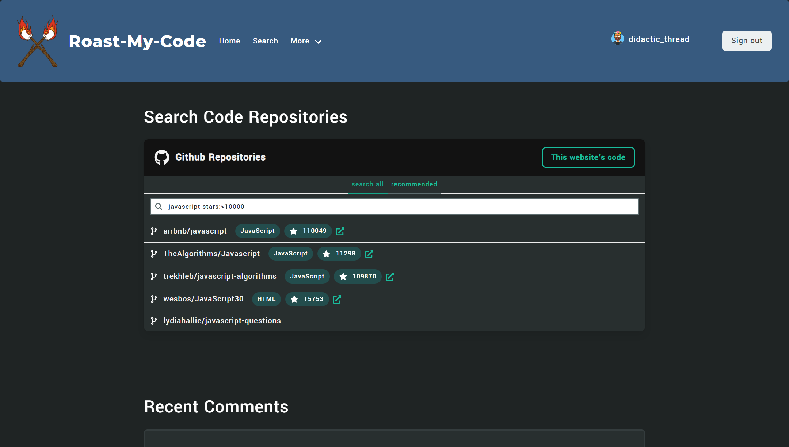
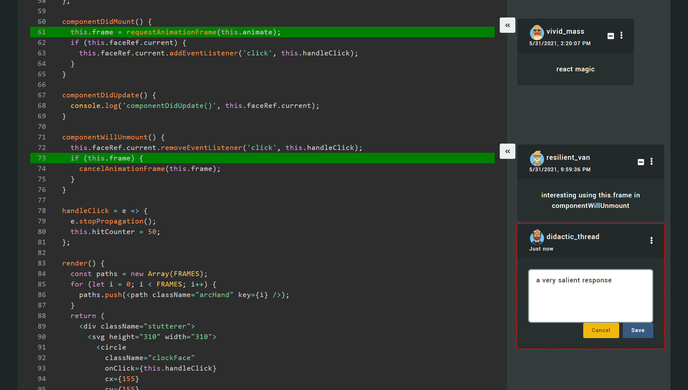

# [Roast My Code](http://www.roast-my-code.com)

## About
This repository started as a test bed for me to learn many new technologies: React, Typescript, GraphQL, and other web technologies like Firebase and AWS. Although I hacked some npm packages together, the truth is I still have a very limited understanding of all of the above. With that in mind, don't be surprised to find some truly terrible and un-idiomatic code in this repository. I'm okay with that - my goal was to ~~pad my resume~~ broadly learn about modern web tech, not to become a master overnight. I like to think that if I was reviewing a pull request of this quality, I would send it back with quite a few comments. What issues can you find?

## Screenshots

### Search Github Repositories

### Syntax highlighting and adding comments:

## Thanks
Roast-My-Code Logo from [杰意](http://www.ecologyofwhy.com/)

[React-Syntax-Highlighter](https://github.com/react-syntax-highlighter/react-syntax-highlighter#readme)

[avataaars](https://getavataaars.com/) and [random-avatar-generator](https://www.npmjs.com/package/random-avatar-generator)

[project-name-generator](https://github.com/aceakash/project-name-generator)
